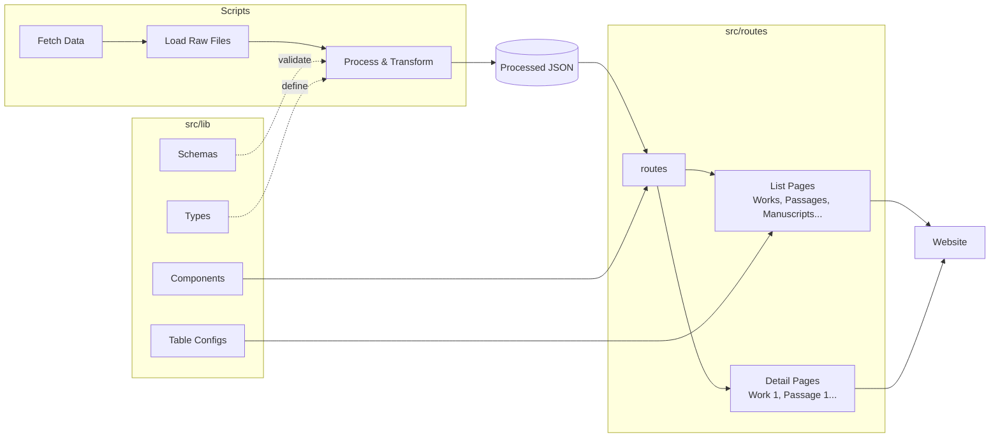

# LOI - Land of Israel in Geonic Times

The **LOI-app** is an application for managing and interacting with a text collection, built using [Svelte-Kit](https://svelte.dev/docs/kit/introduction#What-is-SvelteKit). For more on the **Land of Israel in Geonic Times** project itself see the about page as well as the project site in the [ACDH website](https://www.oeaw.ac.at/acdh/research/dh-research-infrastructure/activities/modelling-humanities-data/loi). 

## Table of Contents

- [Datamodel](#data-model)
- [Getting Started](#getting-started)
- [Project Structure](#project-structure)
- [License](#license)

## Datamodel

To support the researchers’ workflow, the data is entered into a relational database using
[Baserow](https://baserow.io/). The database content is regularly exported as JSON files and stored
in a [sister repository](https://github.com/land-of-israel/loi-baserow-dump). These JSON
files are then processed in the current repository.
The current data model can be seen in [dbdiagram.io](https://dbdiagram.io/d/6a3b89e33b9b0de599620eb7) (last update June 2026).

## Getting started

### Prerequisites

This project uses `pnpm`. If you haven't installed it:

   ```bash
   npm install -g pnpm
   ```

### Setup

Clone the repo, go in the folder, install the dependencies, fetch fresh raw data, process it, run the application: 

   ```bash
   git clone https://github.com/land-of-israel/loi-app.git
   cd loi-app
   pnpm install   
   pnpm fetch-data   
   pnpm process-data   
   pnpm dev
   ```

The project uses a typsense index for the search. To update the index itself you will need the environement variables (typsense admin key) see - > .env.example

```bash
source set_env_variables.sh
pnpm generate-index
``

## Project structure



## License
This project is licensed under the MIT License.
